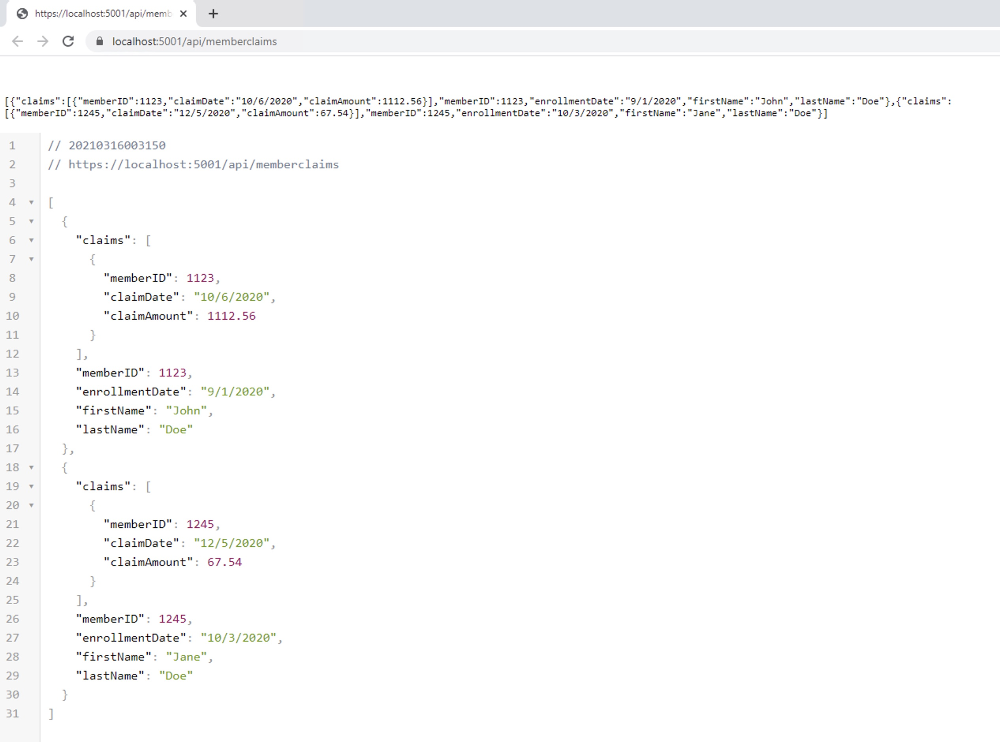

# Project Name
> Dotnet Core5 API with CsvHelper

## General info
Simple Get API to return response using DotNet Core 5 

## Screenshots

## Technologies
* DotNet Core - version 5

## Instructions
1. Download the code
2. Install required packages using dotnet install
3. Run using IIS Express or Self Hosted Server
